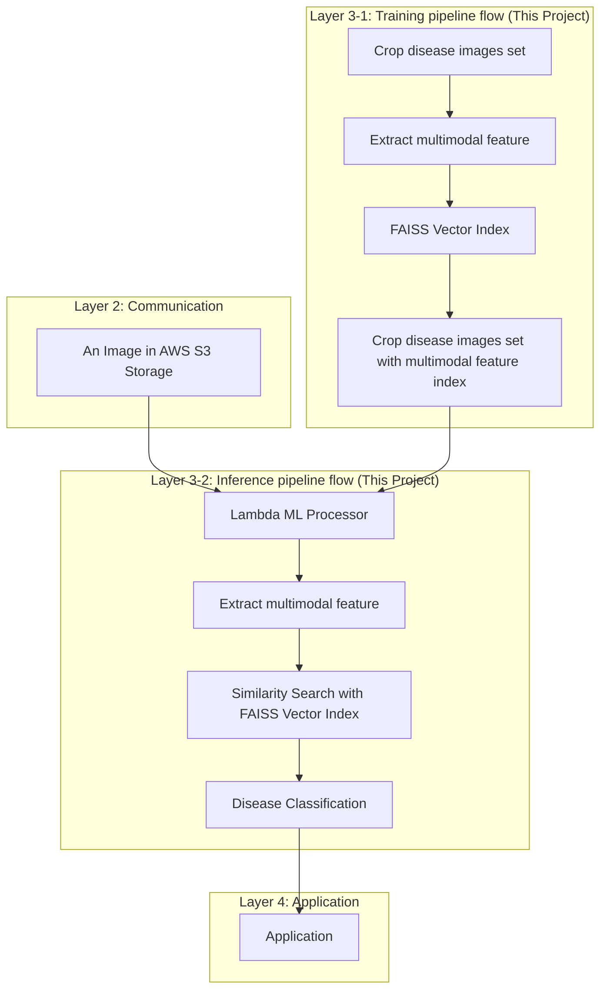

# UoL CM3070 ML - Agricultural Disease Detection Platform

This repository handle the machine learning aspects of the system

## Directory Structure

```
├── Makefile                          # DevPod environment management commands
├── README.md                         # Project overview and quick start guide
├── pyrightconfig.json               # Python static type checking configuration
├── notebook/                         # Jupyter notebooks for ML experimentation
│   ├── faiss_with_hf_datasets_and_clip.ipynb     # Core CLIP+FAISS implementation
│   └── load_faiss_with_hf_datasets_and_clip.ipynb # Dataset loading utilities
│
├── serverless/                       # AWS Lambda application for disease detection
│   ├── Dockerfile                    # Container image definition for Lambda
│   ├── Makefile                      # Build, test, and deployment commands
│   ├── README.md                     # Serverless application documentation
│   ├── pyproject.toml               # Python dependencies and project configuration
│   ├── uv.lock                       # Dependency lock file for reproducible builds
│   └── app/                          # Lambda application source code
│       ├── __init__.py               # Python package initialization
│       └── main.py                   # Lambda handler for agricultural ML processing
└── terraform/                        # Infrastructure as Code (IaC) configuration
    ├── ecr.tf                        # Amazon ECR container registry setup
    ├── iam.tf                        # AWS IAM roles and policies
    ├── kms.tf                        # AWS KMS encryption key management
    ├── lambda.tf                     # AWS Lambda function configuration
    ├── s3.tf                         # S3 buckets for data and model storage
    ├── sagemaker.tf                  # SageMaker notebook and endpoints
    ├── secretsmanager_secret.tf      # AWS Secrets Manager configuration
    ├── secret.yaml                   # SOPS-encrypted secrets and configuration
```

## Architecture
This repository implements **Layer 3 (Machine Learning Layer)** of a 4-layer IoT agricultural monitoring system, featuring CLIP multimodal embeddings and FAISS vector similarity search for real-time plant disease detection.

### System Overview

```
ESP32-CAM Sensors → MQTT Broker → Go MQTT Client → S3 Storage → ML Pipeline
    (Layer 1)        (This Project)     (This Project)    (Layer 3)    (Layer 4)
```

### Data Flow

#### **Training Pipeline Flow** (Layer 3-1)
```
Crop disease images set → Extract multimodal feature → FAISS Vector Index → Crop disease images set with multimodal feature index
```

#### **Inference Pipeline Flow** (Layer 3-2)
```
An Image in AWS S3 Storage → Lambda ML Processor → Extract multimodal feature → Similarity Search with FAISS Vector Index → Disease Classification → Application
```

## Key Features


## Quick Start

```bash
# 1. Set up development environment
make up

# 2. Deploy infrastructure
cd terraform && terraform apply

# 3. Build and deploy ML pipeline
cd serverless && make build-image && make push-image

# 4. Test the system
make run-lambda
```

## System Architecture

This project implements **Layer 3 (Machine Learning)** of a comprehensive 4-layer IoT agricultural monitoring system:



### Performance Targets

- **Detection Accuracy**: ≥85% precision, ≥90% recall
- **Response Time**: <5 minutes end-to-end (capture → detection → alert)
- **Cost Efficiency**: <$0.001 per image, <$50/month per farm
- **Scalability**: Support 100+ concurrent IoT devices
- **Reliability**: 99.5% uptime during growing seasons

## Core ML Components

### 1. **CLIP Multimodal Embeddings**
- **Model**: `openai/clip-vit-base-patch16`
- **Purpose**: Zero-shot disease classification without agricultural fine-tuning
- **Input**: Plant leaf images + disease text descriptions
- **Output**: 512-dimensional embeddings for similarity search

### 2. **FAISS Vector Similarity Search**
- **Algorithm**: IndexFlatL2 for exact search, IndexIVFFlat for approximate
- **Dataset**: 14,404+ tomato leaf samples across 8+ disease categories
- **Query Time**: <2 seconds for k=10 nearest neighbors
- **Storage**: Optimized for S3 cloud deployment

### 3. **AWS Serverless Infrastructure**
- **Lambda**: Containerized Python runtime for ML inference
- **SageMaker**: CLIP model hosting and auto-scaling
- **S3**: Dataset storage and FAISS index persistence
- **ECR**: Docker image registry for deployment

## Key Features

### Advanced Capabilities
- **Zero-shot Learning**: No agricultural training data required
- **Multimodal Processing**: Vision + text understanding
- **Real-time Inference**: Sub-5-minute disease detection
- **Cost-optimized**: Serverless architecture with pay-per-use
- **Scalable**: Supports multiple farms and crop types
- **Secure**: IAM roles, encrypted secrets, VPC isolation

### Agricultural Specialization
- **Disease-specific Patterns**: Early blight, late blight, leaf mold, etc.
- **Environmental Context**: Weather, growth stage, location awareness
- **Economic Optimization**: ROI-focused treatment recommendations
- **Farmer-friendly**: Email/SMS alerts with actionable insights

## Development

### Prerequisites
- DevPod (remote development environment)
- Docker (containerization support)
- AWS CLI (cloud service integration)
- Terraform (infrastructure management)
- Python 3.12+ (ML pipeline runtime)

### Environment Setup

```bash
# Start development environment
make up          # Launch DevPod with Zed IDE
make down        # Stop development environment
make reset       # Reset and restart environment
```

### AWS Configuration
```bash
# Authenticate with AWS
make aws-sso-login
```

## Deployment

### 1. Infrastructure Deployment
```bash
cd terraform

# Initialize Terraform
terraform init

# Review planned changes
terraform plan

# Deploy infrastructure
terraform apply
```

### 2. ML Application Deployment
```bash
cd serverless

# Build Docker image
make build-image

# Push to ECR
make ecr-login
make push-image

# Update Lambda function
aws lambda update-function-code \
  --function-name cm3070-ml-serverless-lambda \
  --image-uri {ACCOUNT}.dkr.ecr.us-east-1.amazonaws.com/cm3070_ml:latest
```

### 3. System Verification
```bash
# Test Lambda function
make run-lambda

# Monitor logs
aws logs tail /aws/lambda/cm3070-ml-serverless-lambda --follow

# Check SageMaker endpoint
aws sagemaker describe-endpoint --endpoint-name my-endpoint
```

## Testing & Validation

### Unit Tests
```bash
# Run local application
cd serverless && make run

# Test individual components
python -m pytest tests/
```

### Integration Tests
```bash
# Test end-to-end pipeline
make run-lambda

# Validate FAISS index
python -c "import faiss; print('FAISS working!')"

# Test CLIP model loading
python -c "from transformers import AutoModel; print('Transformers working!')"
```

### Performance Benchmarks
- **Accuracy Testing**: Validate against tomato disease dataset
- **Latency Benchmarks**: Measure inference response times
- **Load Testing**: Simulate concurrent IoT device requests
- **Cost Analysis**: Track AWS usage and optimization

## Monitoring & Observability

### CloudWatch Metrics
- Lambda function duration and error rates
- SageMaker endpoint invocation counts
- S3 request patterns and costs
- Custom agricultural metrics (diseases detected, farms served)

### Logging Strategy
```python
# Structured logging for agricultural context
logger.info(f"Disease detected: {disease_type}", extra={
    "device_id": device_id,
    "confidence": confidence_score,
    "farm_location": location,
    "processing_time_ms": duration
})
```

## Security & Compliance

### Data Protection
- **Encryption**: All data encrypted at rest (S3) and in transit (TLS)
- **Access Control**: IAM roles with least-privilege principles
- **Secrets Management**: SOPS-encrypted configuration files
- **Network Security**: VPC isolation for sensitive operations

### Privacy Considerations
- **Farmer Data**: Anonymized processing, opt-out available
- **Location Privacy**: Coordinates masked in logs
- **Image Storage**: 30-day retention with automatic deletion
- **GDPR Compliance**: Data portability and deletion rights

## Cost Optimization

### Target Economics
- **Per-image Processing**: <$0.001 USD
- **Monthly Farm Cost**: <$50 USD (including infrastructure)
- **ROI Target**: 10:1 return through crop loss prevention

### Optimization Strategies
- **Serverless Architecture**: Pay-per-use pricing model
- **Batch Processing**: Efficient resource utilization
- **Auto-scaling**: Dynamic capacity based on demand
- **Reserved Capacity**: Cost savings for predictable workloads

## Future Enhancements

### Short-term Roadmap
- [ ] **Multi-crop Support**: Extend beyond tomatoes to peppers, cucumbers
- [ ] **Edge Computing**: Deploy lightweight models to ESP32 devices
- [ ] **Mobile App**: React Native farmer dashboard
- [ ] **Continuous Learning**: Feedback loops for model improvement

### Long-term Vision
- [ ] **Global Deployment**: Multi-region, multi-language support
- [ ] **Advanced AI**: Custom vision transformers for agriculture
- [ ] **Sustainability Metrics**: Carbon footprint tracking and optimization
- [ ] **Market Integration**: Crop pricing and yield prediction
